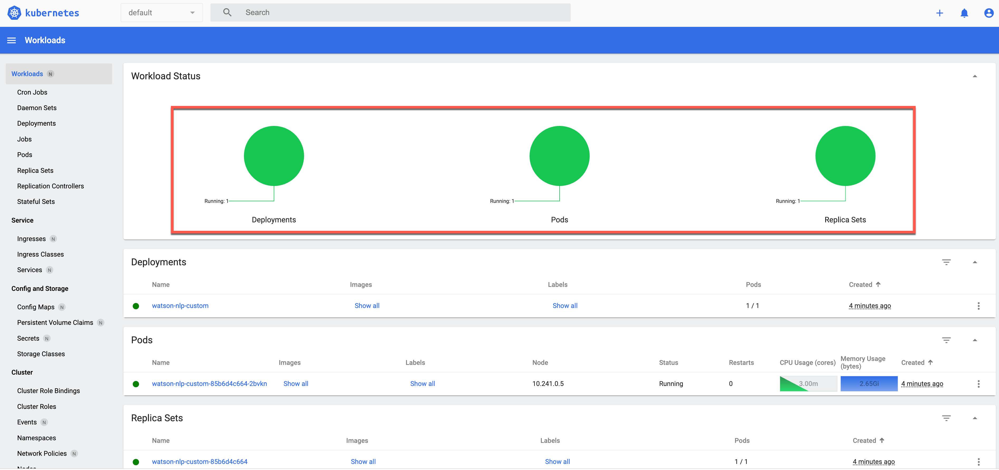

# Create a model init container image for `Watson NLP for Embed`

This project shows how to :

* ... **create** a model [_init container_](https://kubernetes.io/docs/concepts/workloads/pods/init-containers/) with a custom model for [`Watson NLP for Embed`](https://www.ibm.com/docs/en/watson-libraries?topic=watson-natural-language-processing-library-embed-home).
* ... **upload** the `model init container` to the [IBM Cloud container registry](https://www.ibm.com/cloud/container-registry).
* ... **deploy** the `model init container` and the `Watson NLP runtime` to an [IBM Cloud Kubernetes Cluster](https://www.ibm.com/cloud/kubernetes-service).
* ... **test** `Watson NLP runtime` with the loaded model using the `REST API`.

Therefor the project reuses information from the IBM Developer tutorial [_`Serve a custom model on a Kubernetes or Red Hat OpenShift cluster`_](https://developer.ibm.com/tutorials/serve-custom-models-on-kubernetes-or-openshift/).

First let us resume how you can add models to [`Watson NLP for Embed`](https://www.ibm.com/docs/en/watson-libraries?topic=watson-natural-language-processing-library-embed-home) runtime container.

1. You can build a [`Watson NLP for Embed`](https://www.ibm.com/docs/en/watson-libraries?topic=watson-natural-language-processing-library-embed-home) runtime container image including the models. You usually use this for testing at local or serverless environments.[(Example gif)](https://suedbroecker.files.wordpress.com/2022/12/watson-nlp-ce-01.gif?w=736&zoom=2) ([direct copy of the models](https://github.com/thomassuedbroecker/watson-nlp-example-code-engine/blob/main/code/Dockerfile)
2. You can build a [`Watson NLP for Embed`](https://www.ibm.com/docs/en/watson-libraries?topic=watson-natural-language-processing-library-embed-home) runtime container image including the models using a [multistage build](https://github.com/thomassuedbroecker/watson-nlp-example-code-engine/blob/main/code/Multistage.Dockerfile) with pretrained model container images.
2. You can run a [`Watson NLP for Embed`](https://www.ibm.com/docs/en/watson-libraries?topic=watson-natural-language-processing-library-embed-home) runtime and load models from a mounted location (load from Docker volumes). You usually use this for local testing. [(Example gif)](https://suedbroecker.files.wordpress.com/2022/12/watson-nlp-07-1.gif?w=756&zoom=2)
3. You can run a [`Watson NLP for Embed`](https://www.ibm.com/docs/en/watson-libraries?topic=watson-natural-language-processing-library-embed-home) runtime and load the models with [`init container`](https://kubernetes.io/docs/concepts/workloads/pods/init-containers/)s. [Example image](https://suedbroecker.files.wordpress.com/2023/01/watson-nlp-03.png). You usually use this for Kubernetes deployments.
4. You can serve a model from [KServe](https://suedbroecker.net/2023/01/17/run-watson-nlp-for-embed-in-a-kserve-modelmesh-serving-environment-on-an-ibm-cloud-kubernetes-cluster-in-a-vpc-environment/). [(Example gif)](https://suedbroecker.files.wordpress.com/2023/01/watson-nlp-kserve-03.gif?w=756&zoom=2). This is the best production approach, from my perspective.

> And now we are going to build a `custom model container image` we will use as an [`init container`](https://kubernetes.io/docs/concepts/workloads/pods/init-containers/)!

### Architectural overview

You should be aware that an [`init container`](https://kubernetes.io/docs/concepts/workloads/pods/init-containers/) only runs once, because the job of an init container is to ensure the needed environment for the runtime container is available.
In our case the container must provide a model which will be loaded be load from the runtime.


The image below is from the tutorial [Serve a custom model on a Kubernetes or Red Hat OpenShift cluster](https://developer.ibm.com/tutorials/serve-custom-models-on-kubernetes-or-openshift/) and shows the `Architecture reference custom models` and is a bit customized.

In context to our project we can map the steps like this:

1. In [`Watson Studio`](https://cloud.ibm.com/catalog/services/watson-studio) we created the model. For example we followed the steps in the blog post [`Watson NLP for Embed customize a classification model and use it on your local machine`](https://suedbroecker.net/2023/01/26/watson-nlp-for-embed-customize-a-classification-model-and-use-it-on-your-local-machine/)
2. In this project we will create a `model init container image` on the local machine
3. In the bash script automation we will:
    
    * Upload the `model init container image` to the IBM CLoud registry
    * Deploy `Watson NLP runtime` with helm.
    
    Inside the pod (3,4,5):

    * (4) The `model init container` will save the containing model in an volume on the pod. 
    * (5) The `Watson NLP runtime container` will load the model from the pod
    * Invoke the `Watson NLP` REST API to test the loaded model.


[Image source](https://developer.ibm.com/developer/default/tutorials/serve-custom-models-on-kubernetes-or-openshift/images/ref-arch-custom-models.png)

## 1. Create an [`init container`](https://kubernetes.io/docs/concepts/workloads/pods/init-containers/) model image

We will build a `model init container image` with the [`ibm-watson-embed-model-builder`](https://github.com/IBM/ibm-watson-embed-model-builder) python library. This container image will contain our `custom model`, downloaded from Watson Studio.

* Step 1: Clone the repository
* Step 2: Prepare python environment on your local machine
* Step 3: Download a created model and copy it to the folder `code/tmpmodel` 
* Step 4: Unzip your custom model
* Step 5: Prepare the custom model container image
* Step 6: Create the custom model container image
* Step 7: Verify the created model container image

> Note: Here is the [IBM Watson Natural Language Processing Library for Embed **API documentation**](https://developer.ibm.com/apis/catalog/embeddableai--watson-natural-language-processing-apis/api/API--embeddableai--watson-natural-language-processing-apis#ClassificationPredict)

### Step 1: Clone the repository

```sh
git clone https://github.com/thomassuedbroecker/watson-nlp-custom-init-container.git
cd watson-nlp-custom-init-container
```

### Step 2: Prepare python environment on your local machine

We need a python library manages the process of building a collection of docker images that wrap individual `watson_embedded models` for delivery with an `embeddable watson runtime`.

This is implemented in the GitHub project called [`ibm-watson-embed-model-builder`](https://github.com/IBM/ibm-watson-embed-model-builder).

```sh
export TMP_HOME=$(pwd)
cd code
python3 -m venv client-env
source client-env/bin/activate
pip install watson-embed-model-packager
ls
cd $TMP_HOME
```

* Example output:

This will create a folder called `client-env`.

```sh
...
app                     helm_setup              tmpmodel
client-env  
```

### Step 3: Download a created model and copy it to the folder `code/tmpmodel` 

If you don't have a created model you can create one by following this blog post [`Watson NLP for Embed customize a classification model and use it on your local machine`](https://suedbroecker.net/2023/01/26/watson-nlp-for-embed-customize-a-classification-model-and-use-it-on-your-local-machine/).

### Step 4: Save the custom model 

[Ensure you followed the steps in the `readme.md` here in this project.](https://github.com/thomassuedbroecker/watson-nlp-custom-init-container/blob/main/code/tmpmodel/YOUR_MODEL.md)

Your copyed `model archive file` must have the file extension `.zip`.

```sh
export TMP_HOME=$(pwd)
export MODELFILE_NAME=ensemble_model.zip

cd $TMP_HOME/code/tmpmodel
cp $MODELFILE_NAME $TMP_HOME/code/app/models/

cd $TMP_HOME
```

### Step 5: Prepare the custom model container image 

The `watson_embed_model_packager` creates a `model-manifest.csv` which contains the information how to package the custom model init container image.

```sh
export TMP_HOME=$(pwd)
cd $TMP_HOME/code
export CUSTOM_MODEL_LOCATION=./app/models
export CUSTOM_TAG=1.0.0
python3 -m watson_embed_model_packager setup \
    --library-version watson_nlp:3.2.0 \
    --image-tag $CUSTOM_TAG \
    --local-model-dir $CUSTOM_MODEL_LOCATION \
    --output-csv model-manifest.csv
ls
cd $TMP_HOME
```

* Example output:

```sh
..
2023-01-31T12:52:42.622576 [SETUP:INFO] Running SETUP
2023-01-31T12:52:42.622966 [SETUP:INFO] Library Versions: {'watson_nlp': VersionInfo(major=3, minor=2, patch=0, prerelease=None, build=None)}
2023-01-31T12:52:42.623034 [SETUP:INFO] Local Model Dir: /YOUR_PATH/code/models
2023-01-31T12:52:42.623099 [SETUP:INFO] Module GUIDs: []
2023-01-31T12:52:42.623150 [SETUP:INFO] Image tag version: 1.0.0
app                     helm_setup              tmpmodel
client-env              model-manifest.csv
```

### Step 6: Create the custom model container image 

Now we build the `custom model container image` by using the `model-manifest.csv`.

```sh
export TMP_HOME=$(pwd)
cd $TMP_HOME/code
python3 -m watson_embed_model_packager build --config model-manifest.csv
cd $TMP_HOME
```

* Example output:

```sh
2023-01-31T12:57:33.601886 [BUILD:INFO] Building model [custom_model]
2023-01-31T12:57:34.193581 [BUILD:INFO] Building with --platform
[+] Building 105.4s (21/21) FINISHED                                        
...
 => => writing image sha256:4034108815be4eee1a1248e4032e646c136d0e74b  0.0s
 => => naming to docker.io/library/=> => naming to docker.io/library/watson-nlp_ensemble_model:1.0.0 0.0s
```

### Step 7: Verify the created model container image

Verify the container exists.

```sh
docker images | grep watson-nlp_ensemble_model
```

* Example output:

```sh
watson-nlp_ensemble_model                                             1.0.0         dc9d68f955ae   47 seconds ago   1.3GB
```

With `docker inspect` we get the details of the `watson-nlp_ensemble_model` container image.

```sh
docker inspect watson-nlp_ensemble_model:1.0.0
```

* Example output:

```sh
[
    {
        "Id": "sha256:dc9d68f955aed57c0724d903412cac2fe9dcbd55aaf261a47c85b65ab6dd3fba",
        "RepoTags": [
            "watson-nlp_ensemble_model:1.0.0",
...
```

### Step 7: Start the model container locally

```sh
export CONTAINER_NAME=verify-model
export CONTAINER_IMAGE=watson-nlp_ensemble_model:1.0.0
docker run -it --name "$CONTAINER_NAME" "$CONTAINER_IMAGE" /bin/bash
```

* Example output:

```sh
Archive:  /app/model.zip
  inflating: config.yml    
  ... 
```

## Deploy to Kubernetes

We will deploy the **custom [Watson NLP for Embed](https://www.ibm.com/docs/en/watson-libraries?topic=watson-natural-language-processing-library-embed-home) model** with a preconfigured [Helm chart](https://github.com/thomassuedbroecker/watson-nlp-custom-init-container/blob/main/code/helm_setup/charts/watson-nlp-custom/Chart.yaml) in this project for an existing Kubernetes Cluster.

We are using in this section from IBM Cloud:

* An existing [IBM Cloud Kubernetes cluster](https://www.ibm.com/cloud/kubernetes-service) 
* The [IBM Cloud Container Registry](https://www.ibm.com/cloud/container-registry)


### Step 1: Navigate to the Helm setup

```sh
cd code/helm_setup
```

### Step 2: Set environment variables in the `.env` file

```sh
cat .env_template > .env
```

Edit the `.env` file.

```sh
# used as 'environment' variables
export IC_API_KEY=YOUR_IBM_CLOUD_ACCESS_KEY
export IC_EMAIL="YOUR_EMAIL"
export IBM_ENTITLEMENT_KEY="YOUR_KEY"
export IBM_ENTITLEMENT_EMAIL="YOUR_EMAIL"
export CLUSTER_ID="YOUR_CLUSTER"
export REGION="us-east"
export GROUP="tsuedbro"
```

### Step 3: Run the helm automation to deploy the model

```sh
sh deploy-watson-nlp-custom-to-kubernetes.sh
```

**Automation steps of the bash script:**

1. [Log on to IBM Cloud.](https://github.com/thomassuedbroecker/watson-nlp-custom-init-container/blob/main/code/helm_setup/deploy-watson-nlp-custom-to-kubernetes.sh#L23)
2. [Configure the IBM Cloud registry and a namespace, if needed.](https://github.com/thomassuedbroecker/watson-nlp-custom-init-container/blob/main/code/helm_setup/deploy-watson-nlp-custom-to-kubernetes.sh#L36)
3. [Change the `tag` of the custom container image and  `upload` the custom image to the IBM Cloud registry container registry.](https://github.com/thomassuedbroecker/watson-nlp-custom-init-container/blob/main/code/helm_setup/deploy-watson-nlp-custom-to-kubernetes.sh#L49)
4. [Create the `Docker config file` needed to create a pull secret for the custom container and the runtime container.](https://github.com/thomassuedbroecker/watson-nlp-custom-init-container/blob/main/code/helm_setup/deploy-watson-nlp-custom-to-kubernetes.sh#L70) ([Docker config.json file template](https://github.com/thomassuedbroecker/watson-nlp-custom-init-container/blob/main/code/helm_setup/custom_config.json_template))
5. [Connect the Kubernetes Cluster](https://github.com/thomassuedbroecker/watson-nlp-custom-init-container/blob/main/code/helm_setup/deploy-watson-nlp-custom-to-kubernetes.sh#L58)
6. [Install `Helm Chart`](https://github.com/thomassuedbroecker/watson-nlp-custom-init-container/blob/main/code/helm_setup/deploy-watson-nlp-custom-to-kubernetes.sh#L93)
7. [Verify invocation from the running container](https://github.com/thomassuedbroecker/watson-nlp-custom-init-container/blob/main/code/helm_setup/deploy-watson-nlp-custom-to-kubernetes.sh#L116)
8. [Verify invocation from the local machine](https://github.com/thomassuedbroecker/watson-nlp-custom-init-container/blob/main/code/helm_setup/deploy-watson-nlp-custom-to-kubernetes.sh#L146)
9. [Uninstall Helm Chart](https://github.com/thomassuedbroecker/watson-nlp-custom-init-container/blob/main/code/helm_setup/deploy-watson-nlp-custom-to-kubernetes.sh#L164)

**Helm templates:**

1. [Deployment](https://github.com/thomassuedbroecker/watson-nlp-custom-init-container/blob/main/code/helm_setup/charts/watson-nlp-custom/templates/depoyment.yaml)
2. [Pull secret](https://github.com/thomassuedbroecker/watson-nlp-custom-init-container/blob/main/code/helm_setup/charts/watson-nlp-custom/templates/pull-secret-ibm-entitlement-key.yaml)
3. [Cluster service](https://github.com/thomassuedbroecker/watson-nlp-custom-init-container/blob/main/code/helm_setup/charts/watson-nlp-custom/templates/service-cluster-ip.yaml)
4. [Load balancer service](https://github.com/thomassuedbroecker/watson-nlp-custom-init-container/blob/main/code/helm_setup/charts/watson-nlp-custom/templates/service-loadbalancer.yaml)
5. [Values file for the `Helm templates`](https://github.com/thomassuedbroecker/watson-nlp-custom-init-container/blob/main/code/helm_setup/custom_config.json_template)

* Example interactive output:

```sh
*********************
loginIBMCloud
*********************

API endpoint: https://cloud.ibm.com
Region: us-east
Authenticating...
OK

...

# ******
# Configure IBM Cloud Registry
# ******

The region is set to 'us-south', the registry is 'us.icr.io'.
...
a4c04ef9f22e: Layer already exists 
1.0.0: digest: sha256:7dad37c2eb633eb569df6617c6895d39a9741fe5be2b0991c93f9b3a4acd7510 size: 1994

*********************
createDockerCustomConfigFile
*********************

- custom_config.json
IBM_ENTITLEMENT_SECRET: 
...
- charts/values.yaml
Set values:
- us.icr.io/custom-watson-nlp-tsued/watson-nlp_ensemble_model:1.0.0
...

*********************
connectToCluster
*********************

OK
...

*********************
installHelmChart
*********************

...

1 chart(s) linted, 0 chart(s) failed
NAME: watson-nlp-custom
LAST DEPLOYED: Thu Feb  9 19:55:14 2023
NAMESPACE: default
STATUS: deployed
REVISION: 1
TEST SUITE: None

*********************
verifyDeploment
*********************


------------------------------------------------------------------------
Check for (watson-nlp-custom)
(1) from max retrys (4)
Status: watson-nlp-custom
2023-02-09 12:55:16 Status: watson-nlp-custom is created
------------------------------------------------------------------------

*********************
verifyPod could take 10 min
*********************


------------------------------------------------------------------------
Check for (watson-nlp-custom)
(1) from max retrys (10)
Status: 0/1
2023-02-09 19:55:16 Status: watson-nlp-custom(0/1)
------------------------------------------------------------------------
(2) from max retrys (10)
Status: 1/1
2023-02-09 19:56:17 Status: watson-nlp-custom is created
------------------------------------------------------------------------

*********************
verifyWatsonNLPContainer
*********************

Pod: watson-nlp-custom-85b6d4c664-snkx6

Result of the Watson NLP API request:
http://localhost:8080/v1/watson.runtime.nlp.v1/NlpService/ClassificationPredict

{"classes":[{"className":"Credit card or prepaid card","confidence":0.61427313},{"className":"Credit reporting, credit repair services, or other personal consumer reports","confidence":0.104456775},{"className":"Checking or savings account","confidence":0.1030437},{"className":"Debt collection","confidence":0.08048885},{"className":"Mortgage","confidence":0.0071709333}],"producerId":{"name":"Voting based Ensemble","version":"0.0.1"}}

Verify the running pod on your cluster.

Press any key to move on:
```

Now your IBM Cloud UI will be opened again and you can open the Kubernetes Dashboard if you want to.


```sh
...
NAME                                 READY   STATUS    RESTARTS   AGE
watson-nlp-custom-85b6d4c664-snkx6   1/1     Running   0          66s
Verify in the deployment in the Kubernetes dashboard.

Press any key to move on:
...
```

 You can verify the deployment in Kubernetes dashboard. 

 


```sh
*********************
verifyWatsonNLP_loadbalancer
this could take up to 10 min
*********************


*********************
verifyLoadbalancer
*********************

...
------------------------------------------------------------------------
Status: 52.XXX.XXX.XXXX
2023-02-09 20:06:31 Status: watson-nlp-custom-vpc-nlb is created (52.XXX.XXX.XXXX)
------------------------------------------------------------------------
EXTERNAL_IP: 52.XXX.XXX.XXXX
Verify invocation of Watson NLP API from the local machine:
{
  "classes": [
    {
      "className": "Credit card or prepaid card",
      "confidence": 0.59203154
    },
    {
      "className": "Checking or savings account",
      "confidence": 0.10723788
    },
    {
      "className": "Credit reporting, credit repair services, or other personal consumer reports",
      "confidence": 0.107137166
    },
    {
      "className": "Debt collection",
      "confidence": 0.08883385
    },
    {
      "className": "Mortgage",
      "confidence": 0.008399018
    }
  ],
  "producerId": {
    "name": "Voting based Ensemble",
    "version": "0.0.1"
  }
}

*********************
uninstallHelmChart
*********************

Press any key to move on with UNINSTALL:
```

Now you can deside if you want to uninstall the confguration directly.

```sh
release "watson-nlp-custom" uninstalled
```

